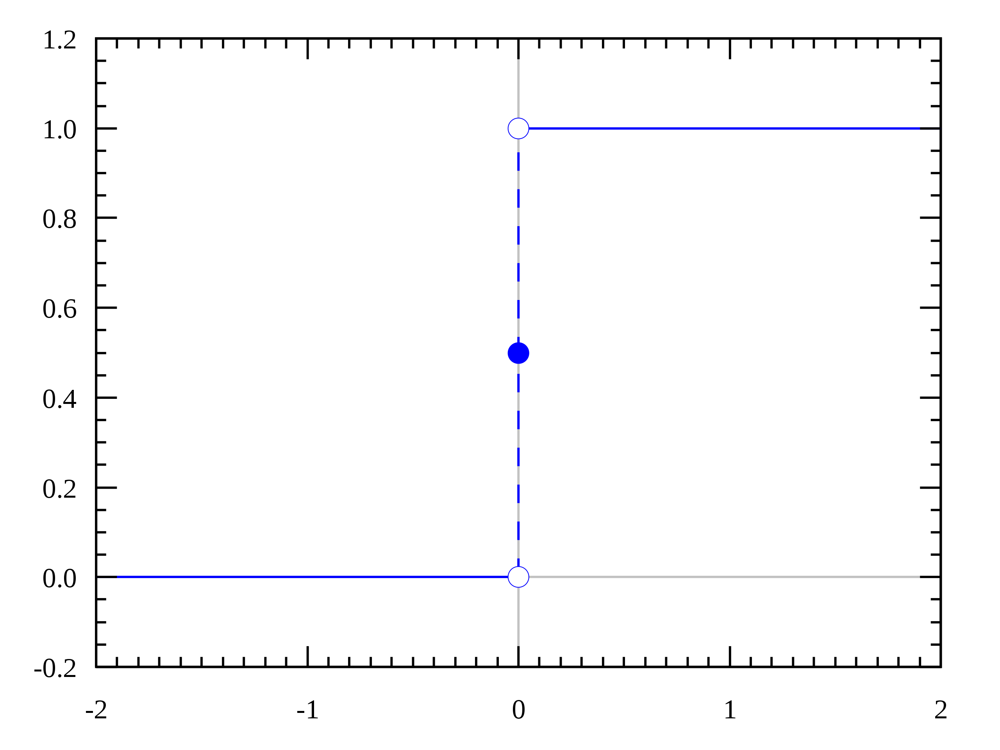
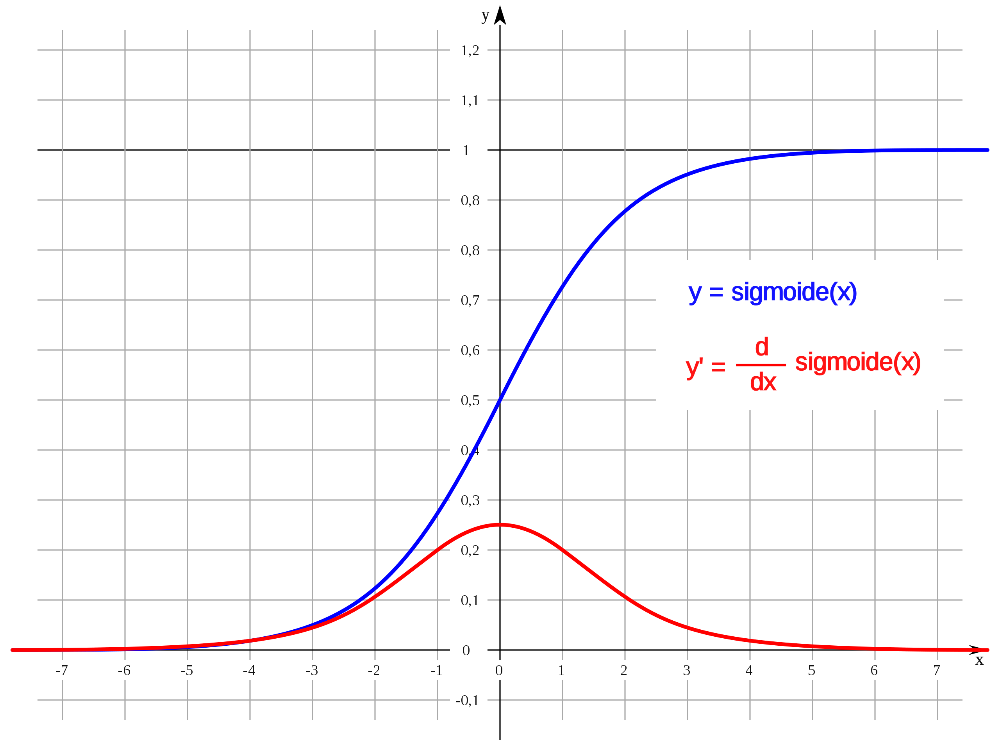
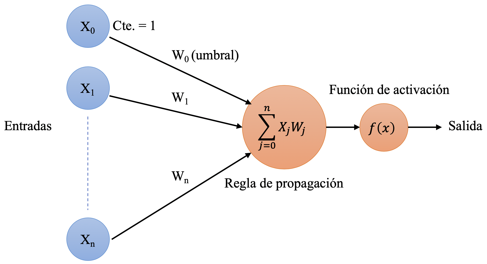
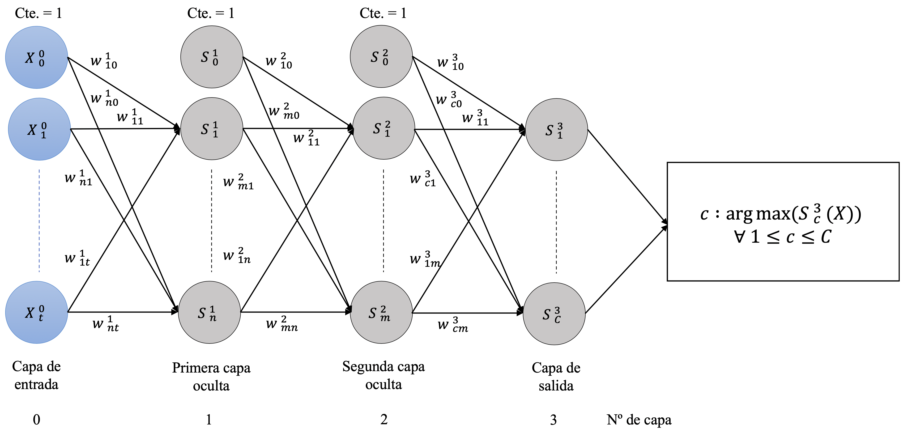

# Simple Neural Network.

Simple neural network is a library written in python for educational purposes.

There are 3 types of neural systems implemented, such as:

* Binary classifier.
* Multiclass classifier.
* Multilayer neural network.

The main purpose of this notebook is to present the way in which each of the elements of this library are programmed.

The location of each of the elements within the library structure will be referred to as follows: `simple_neural_network/package(s)/file.py`.
Being `simple_neural_network` the root of the library.


## 1. Dependencies.

We will first define the necessary dependencies to be able to use this library and we will make a distinction between those that already come by default with python
and those that must be downloaded explicitly.

* Python packages:
    * `csv`: dedicated to reading data from CSV files.
    * `pickle`: used to save and load neural systems to disk and be able to reuse them.
    * `enum`: used for the definition of enums, such as the types of activation functions.

* External dependencies:
    * `matplotlib`: used to represent information graphically.
    * `numpy`: used to work with matrices and to perform operations with them in a more comfortable and efficient way.


```python
import csv
import pickle
from enum import Enum

import matplotlib.pyplot as plt
import numpy as np

```

## 2. Constants.

Location: `simple_neural_network/constants/constants.py`

This file is created for a simpler and more localized handling of the constant values of the elements that make up the library.


```python
# Utilities
OBJECTS_SAVED_EXTENSION = '.snn'

# Logs
ERROR_RATE = 'Epoch {epoch}: {misclassified_samples} misclassified samples out of {samples} ' \
             '-> error rate = {error_rate:.2f}'

# Activation functions
ACTIVATION_FUNCTIONS = dict(STEP_FUNCTION_VALUE=0)

# Binary classifier
BINARY_CLASSIFIER = dict(LEARNING_RATE_DEFAULT_VALUE=1, MAX_EPOCHS_DEFAULT_VALUE=10)

# Multiclass classifier
MULTICLASS_CLASSIFIER = dict(LEARNING_RATE_DEFAULT_VALUE=1, MAX_EPOCHS_DEFAULT_VALUE=10)

# Multilayer neural network
MULTILAYER_NEURAL_NETWORK = dict(LEARNING_RATE_DEFAULT_VALUE=0.1, MAX_EPOCHS_DEFAULT_VALUE=20,
                                 NEURON_DIMENSION=0, NEURON_ACTIVATION_FUNCTION=1)

```

## 3. Utilities.
### 3.1. Reading data from CSV files.

Location: `simple_neural_network/utilities/data_loader/csv_data_loader.py`

One of the library's utilities is a module for reading data from files `.csv`, since these files are very common for the representation of data sets.

It can be seen how there are two static public methods capable of generating a numpy array for both data and labels, being the data type `np.double` and `np.intc` respectively.

This array returned by each method is generated from the data in the csv file that is passed as a parameter. In addition to the path to the file `.csv`, two more parameters must be entered,
the delimiter used to separate the data and if we want to omit the first line of the file, in many cases the first line is the header of the same.

* Functions:
    * `__load_data(path_to_csv_file, delimiter, discard_first_row)`: private function in charge of reading file `.csv` passed as parameter and return a list of data.
    * `load_samples(path_to_csv_file, delimiter, discard_first_row)`: header function that makes a call to `__load_data(path_to_csv_file, delimiter, discard_first_row)` to load the sample data
    and return it in a list of `np.double` type.
    * `load_labels(path_to_csv_file, delimiter, discard_first_row)`: header function that makes a call to `__load_data(path_to_csv_file, delimiter, discard_first_row)` to load label data
    and return it in a list of `np.intc` type.

    Parameters:
        * `path_to_csv_file`: path to `.csv` file.
        * `delimiter`: delimiter character used to separate the data values in the `.csv` file, they are usually: `,` o `;`.
        * `discard_first_row`: boolean that indicates whether or not we want to discard the first row of the file.


The dimensions of the data array will be NxM, where N is the number of rows and M is the number of columns in the `.csv` file.
And Nx1 for the tag array.

Example of use:

Note how the first line of the `.csv` file is removed, since it contains the description of the columns.

`samples.csv`
```
# sepal_length, # petal_length
5.1, 1.4
4.9, 1.4
4.7, 1.3
4.6, 1.5
```
`CSVDataLoader.load_samples(samples.csv, ',', True)` -> [[5.1, 1.4], [4.9, 1.4], [4.7, 1.3], [4.6, 1.5]]

`labels.csv`
```
# labels (0 = Iris-setosa, 1 = Iris-versicolor)
0
0
0
0
```
`CSVDataLoader.load_labels(labels.csv, ',', True)` -> [[0], [0], [0], [0]]


```python
class CSVDataLoader:

    @staticmethod
    def __load_data(path_to_csv_file, delimiter, discard_first_row):
        with open(path_to_csv_file) as samples_csv_file:
            data = csv.reader(samples_csv_file, delimiter=delimiter)

            data_list = []
            for row in data:
                data_list.append(row)

            if discard_first_row:
                data_list.pop(0)

            return data_list

    @staticmethod
    def load_samples(path_to_csv_file, delimiter, discard_first_row):
        return np.array(CSVDataLoader.__load_data(path_to_csv_file, delimiter, discard_first_row), dtype=np.double)

    @staticmethod
    def load_labels(path_to_csv_file, delimiter, discard_first_row):
        return np.array(CSVDataLoader.__load_data(path_to_csv_file, delimiter, discard_first_row), dtype=np.intc)

```

### 3.2. Data normalization.

Location: `simple_neural_network/utilities/normalization/normalization.py`

This utility corresponds to a module for the implementation of the different data normalization functions.

* Functions:
    * `z_score(data)`: receives a list of type `np.double` and returns another normalized list of type` np.double`.
     This function corresponds to Z-score `Z = (x - m) / d`,
     where each sample is subtracted and divided by the mean and standard deviation of the data set respectively.

    Parameters:
        * `data`: list of type `np.double` corresponding to the data.


```python
class Normalization:

    @staticmethod
    def z_score(data):
        min_value = data.min()
        max_value = data.max()
        scaled_data = np.divide((data - min_value), (max_value - min_value))
        return np.divide((scaled_data - scaled_data.mean()), scaled_data.std())

```

### 3.3. Message printing system.

Location: `simple_neural_network/utilities/logger/logger.py`

This package will implement the different functions in charge of printing the messages that will be displayed by console in the process of executing the library.

* Functions:
    * `print_error_rate_message(epoch, misclassified_samples, samples, error_rate)`: formats and prints the data delivered as parameters.

    Parameters:
        * `epoch`: current iteration.
        * `misclassified_samples`: number of misclassified samples in the current iteration.
        * `samples`: total number of training samples.
        * `error_rate`: error rate made in the current iteration.


```python
class Logger:

    @staticmethod
    def print_error_rate_message(epoch, misclassified_samples, samples, error_rate):
        print(ERROR_RATE.format(epoch=epoch, misclassified_samples=misclassified_samples,
                                samples=samples, error_rate=error_rate))

```

### 3.4. Saving and loading of neural systems.

Location: `simple_neural_network/utilities/neural_systems_picker/neural_systems_picker.py`

Another implemented utility is the saving and loading of neural systems. Two static methods are defined for saving and loading neural systems on disk.
You can see how the file extension is defined in the constant `OBJECTS_SAVED_EXTENSION = '.snn'`.

This allows us to reuse already trained networks to make more efficient use of them.

* Functions:
    * `save_neural_system(file_name, neural_system)`: function for saving the neural system passed as a parameter on disk.

    Parameters:
        * `file_name`: path to the `.snn` file where the neural system will be saved.
        * `neural_system`: neural system to save.

    * `load_neural_system(file_name)`: function in charge of loading the file found in the path `file_name` as a neural system in memory.

    Parameters:
        * `file_name`: path to the `.sin` file to be loaded as neural system.


```python
class NeuralSystemPicker:

    @staticmethod
    def save_neural_system(file_name, neural_system):
        file = open(file_name + OBJECTS_SAVED_EXTENSION, 'wb')
        pickle.dump(neural_system, file)

    @staticmethod
    def load_neural_system(file_name):
        file = open(file_name, 'rb')
        return pickle.load(file)

```

## 4. Activation functions.

In this module the different activation functions that will be used in the library are defined and implemented.

* `STEP_FUNCTION`: Step function.


* `IDENTITY_FUNCTION`: Identity function.


* `SIGMOID_FUNCTION`: Sigmoid function.


### 4.1. Enums.

Location: `simple_neural_network/activation_functions/activation_functions_enum.py`

This file lists the different types of activation functions. This allows us a more comfortable way to reference them.


```python
class ActivationFunctionsEnum(Enum):
    STEP_FUNCTION = 1
    IDENTITY_FUNCTION = 2
    SIGMOID_FUNCTION = 3

```

### 4.2. Implementation.

Location: `simple_neural_network/activation_functions/activation_functions.py`

The different activation functions are implemented in this file.

* Functions:
    * `step_function(x)`: implementation of the step function, receives an input value and returns 0 or 1.
    * `identity_function(x)`: implementation of the identity function, it returns the same value it receives.
    * `sigmoid_function(x)`: implementation of the sigmoid function, returns a value between (0, 1).

    Parameters:
        * `x`: input value of function of type `double` .


```python
class ActivationFunctions:

    @staticmethod
    def step_function(x):
        return np.heaviside(x, ACTIVATION_FUNCTIONS.get('STEP_FUNCTION_VALUE'))

    @staticmethod
    def identity_function(x):
        return x

    @staticmethod
    def sigmoid_function(x):
        return 1 / (1 + np.exp(-x))

```

## 5. Loss function.

This module defines the different cost functions that will be used in the _Backpropagation_ algorithm.

### 5.1 Enums.

Location: `simple_neural_network/loss_functions/loss_functions_enum.py`

This file lists the different types of cost functions. This allows us a more comfortable way to reference them.

In that case the `MSE_FUNCTION` corresponds to _mean square error_ function.


```python
class LossFunctionsEnum(Enum):
    MSE_FUNCTION = 1

```

## 6. Perceptron.

Location: `simple_neural_network/neuron/neuron.py`

The `Neuron` class is the main element of this library, since it will be part of all the neural systems that will be defined below.



Elements that make up the neuron class:

* Constructor:
    * `Neuron(number_of_inputs, activation_function)`: returns a `Neuron` object.

        Parameters:
        * `number_of_inputs`: integer that indicates the number of inputs of the neuron (dimension of the samples).
        An extra value equal to 1 is added to the number of entries, which refers to the constant that multiplies the bias of the weights.
        * `activation_function`: activation function type.

* Attributes:
    * `__weights`: represent neuron's weights.
    * `__activation_function`: refers to the type of activation function defined for the neuron. Being a value of the enum `ActivationFunctionsEnum` defined above.

* Functions:
    * `weights()`: `__weights` attribute getter.
    * `weights(value)`: `__weights` attribute setter.

        Parameters:
        * `value`: value assigned to the `__weights` attribute.

    * `activation_function()`: `__activation_function` attribute getter.
    In this case, a setter is not defined since the creation of this attribute is done in the constructor and should not change during the execution of the program.
    * `__calculate_propagation(input_values)`: propagation function of the input values and weights of the neuron. In this case it is the scalar product between both vectors.
    It is a private method since it should only be used by the `calculate_output(input_values)` function.

        Parameters:
        * `input_values`: input values (sample) on which to apply the propagation rule together with the neuron weights.

    * `calculate_output(input_values)`: neuron activation function, for calculating its output based on the type of activation function defined in the constructor.

        Parameters:
        * `input_values`: input values (sample) on which they obtain the output value by the neuron.


```python
class Neuron:

    def __init__(self, number_of_inputs, activation_function):
        self.__weights = np.random.randn(number_of_inputs + 1)
        self.__activation_function = activation_function

    @property
    def weights(self):
        return self.__weights

    @weights.setter
    def weights(self, value):
        self.__weights = value

    @property
    def activation_function(self):
        return self.__activation_function

    def __calculate_propagation(self, input_values):
        return np.dot(self.weights, input_values)

    def calculate_output(self, input_values):
        input_values = np.append(1, input_values)
        if self.activation_function is ActivationFunctionsEnum.STEP_FUNCTION:
            return ActivationFunctions.step_function(self.__calculate_propagation(input_values))
        elif self.activation_function is ActivationFunctionsEnum.IDENTITY_FUNCTION:
            return ActivationFunctions.identity_function(self.__calculate_propagation(input_values))
        elif self.activation_function is ActivationFunctionsEnum.SIGMOID_FUNCTION:
            return ActivationFunctions.sigmoid_function(self.__calculate_propagation(input_values))

```

## 7. Neural systems.
### 7.1. Binary classifier.

Location: `simple_neural_network/neural_systems/binary_classifier/binary_classifier.py`

It is the first neural system defined since it is the most basic and the one that requires the least elements.

This system is capable of defining a linear boundary between two classes and is composed of a single neuron capable of classifying a sample into two unique values, 0 or 1.

Given some weights _W_ and a data _X_ both of dimension _n_, the function that defines a binary classifier is the following:

\begin{equation} g(x)=\begin{cases}
          1, \quad X \cdot W > 0 \\
          0, \quad X \cdot W \le 0 \\
     \end{cases} \quad \forall X,W \in \mathbb R^n
\end{equation}

Elements that make up the binary classifier:

* Constructor:
    * `BinaryClassifier(number_of_inputs)`: returns a `BinaryClassifier` object.

        Parameters:
        * `number_of_inputs`: integer that indicates the number of inputs of the neuron (dimension of the samples).

* Attributes:
    * `__neuron`: attribute of `Neuron` type defined above, eshe performs the classification and must be trained
    It is instantiated using the `ActivationFunctionsEnum.STEP_FUNCTION` step activation function.
    * `__learning_rate`: attribute that defines the learning speed of the algorithm, values close to zero suppose smoother convergences but with more iterations.
    * `__max_epochs`: attribute that defines the maximum number of iterations that the algorithm will perform in case the samples are not linearly separable.
    * `__misclassified_samples_per_epoch`: is a list where each element corresponds to the number of misclassified samples in the pos + 1 iteration of the list.
    That is, `__misclassified_samples_per_epoch[x]` corresponds to the number of misclassified samples in iteration x + 1.

* Functions:
    * `learning_rate()`: `__learning_rate` attribute getter.
    In this case, a setter is not defined since the definition of this attribute is done in the `train(samples, labels, learning_rate, max_epochs)` method and must not change during execution.
    * `max_epochs()`: `__max_epochs` attribute getter.
    In this case, a setter is not defined since the definition of this attribute is done in the `train(samples, labels, learning_rate, max_epochs)` method and must not change during execution.
    * `misclassified_samples_per_epoch()`: consultor del atributo `__misclassified_samples_per_epoch`.
    In this case, a setter is not defined as this attribute is generated at runtime.
    * `epochs()`: this function returns the total number of iterations carried out during the training process.
    Its value is obtained from the dimension of the `__misclassified_samples_per_epoch` attribute.
    * `weights()`: `__neuron.weights()` attribute getter defined in `Neuron` class.
    * `train(samples, labels, learning_rate, max_epochs)`: function for training the system,
    the algorithm used is that of the perceptron with the rate attribute mode for training speed.

        Parameters:
        * `samples`: a `np.array` of `np.double` type for samples.
        * `labels`: a `np.array` of `np.intc` type for labels.
        The samples will have a dimension NxM and the labels Nx1 where N refers to the number of samples, M to the dimension of the same and where the label label [x] is the one corresponding to the sample sample [x].
        * `learning_rate`: algorithm learning speed; by default its value is 1 `BINARY_CLASSIFIER.get('LEARNING_RATE_DEFAULT_VALUE')`.
        * `max_epochs`: maximum number of iterations of the algorithm; by default its value is 10 `BINARY_CLASSIFIER.get('MAX_EPOCHS_DEFAULT_VALUE')`.

    It can be seen how the algorithm runs until either all the samples have been correctly classified in the same iteration or the maximum number of iterations is reached.

    * `classify(sample)`: function in charge of classifying a sample, returns 0 or 1.

        Parameters:
        * `sample`: a `np.array` of `np.double` type that represents a sample.

    * `calculate_error_rate(samples, labels):`: function for calculating the error rate committed by the system when classifying the samples delivered as parameters with their respective labels.

        Parameters:
        * `samples`: a `np.array` of `np.double` type for samples.
        * `labels`: a `np.array` of `np.intc` type for labels.
        The samples will have a dimension NxM and the labels Nx1 where N refers to the number of samples, M to the dimension of the same and where the label label [x] is the one corresponding to the sample sample [x].


```python
class BinaryClassifier:

    def __init__(self, number_of_inputs):
        self.__neuron = Neuron(number_of_inputs, ActivationFunctionsEnum.STEP_FUNCTION)
        self.__learning_rate = BINARY_CLASSIFIER.get('LEARNING_RATE_DEFAULT_VALUE')
        self.__max_epochs = BINARY_CLASSIFIER.get('MAX_EPOCHS_DEFAULT_VALUE')
        self.__misclassified_samples_per_epoch = []

    @property
    def learning_rate(self):
        return self.__learning_rate

    @property
    def max_epochs(self):
        return self.__max_epochs

    @property
    def misclassified_samples_per_epoch(self):
        return self.__misclassified_samples_per_epoch

    @property
    def epochs(self):
        return len(self.__misclassified_samples_per_epoch)

    @property
    def weights(self):
        return self.__neuron.weights

    def train(self, samples, labels, learning_rate=BINARY_CLASSIFIER.get('LEARNING_RATE_DEFAULT_VALUE'),
              max_epochs=BINARY_CLASSIFIER.get('MAX_EPOCHS_DEFAULT_VALUE')):
        self.__learning_rate = learning_rate
        self.__max_epochs = max_epochs
        epoch = 0

        while True:
            well_classified_samples = 0
            misclassified_samples = 0

            for sample, label in zip(samples, labels):
                error = label - self.__neuron.calculate_output(sample)
                if error != 0:
                    self.__neuron.weights += (self.learning_rate * error * np.append(1, sample))
                    misclassified_samples += 1
                else:
                    well_classified_samples += 1

            epoch += 1
            self.misclassified_samples_per_epoch.append(misclassified_samples)
            Logger.print_error_rate_message(epoch, misclassified_samples, len(samples),
                                            (misclassified_samples / len(samples)))

            if epoch == self.max_epochs or well_classified_samples == samples.shape[0]:
                break

    def classify(self, sample):
        return self.__neuron.calculate_output(sample)

    def calculate_error_rate(self, samples, labels):
        errors = 0

        for sample, label in zip(samples, labels):
            if self.classify(sample) != label[0]:
                errors += 1

        return errors / len(labels)

```

#### 7.1.1. Example of using of the binary classifier.

Location: `usage_binary_classifier.py`

Use: `python src/usage_binary_classifier.py`

In this file an example of the use of the binary classifier is carried out with a real data set such as iris-setosa and iris-versicolor.

There are four `.csv` files in the`/data/iris_virginica` directory, these files contain the length of petals and sepals of each type of flower and its class:
* `iris_virginica_train_60_samples.csv` and `iris_virginica_train_60_labels.csv` are the samples and labels used for training the system.
* `iris_virginica_test_40_samples.csv` and `iris_virginica_test_40_labels.csv` are the samples and labels used to obtain the error rate obtained by the system once it has been trained.

First of all the data `train_samples`, `train_labels`, `train_labels` and `test_labels` are loaded using`CSVData`.

We instantiate a `BinaryClassifier(train_samples.shape[1])`, where `train_samples.shape[1] = dimensión de la primera muestra = 2` and train it `binary_classifier.train(train_samples, train_labels, 0.8, 20)` with `rate = 0.8` and `max_iterations = 20`.

After training the system and as an example, we save it to disk `NeuralSystemsPicker.save_neural_system('./serialized_objects/binary_classifier', binary_classifier)`
and we load it `binary_classifier = NeuralSystemsPicker.load_neural_system('./serialized_objects/binary_classifier.snn')`.

We calculate the error rate obtained by the system using the function `binary_classifier.calculate_error_rate(test_samples, test_labels)` and we show it by console.

Finally we represent the data obtained:
* First we print the samples and the intersection of the hyperplane generated by the classifier with the XY plane for Z = 0.
* Finally we print the number of errors per iteration obtained during training.


```python
train_samples = CSVDataLoader.load_samples('./data/iris_virginica/iris_virginica_train_60_samples.csv', ',', True)
train_labels = CSVDataLoader.load_labels('./data/iris_virginica/iris_virginica_train_60_labels.csv', ',', True)
test_samples = CSVDataLoader.load_samples('./data/iris_virginica/iris_virginica_train_60_samples.csv', ',', True)
test_labels = CSVDataLoader.load_labels('./data/iris_virginica/iris_virginica_train_60_labels.csv', ',', True)

binary_classifier = BinaryClassifier(train_samples.shape[1])
binary_classifier.train(train_samples, train_labels, 0.8, 20)

NeuralSystemPicker.save_neural_system('./serialized_objects/binary_classifier', binary_classifier)
binary_classifier = NeuralSystemPicker.load_neural_system('./serialized_objects/binary_classifier.snn')

print(binary_classifier.calculate_error_rate(test_samples, test_labels))

plt.scatter(np.array(train_samples[:30, 0]), np.array(train_samples[:30, 1]), marker='o', label='Setosa')
plt.scatter(np.array(train_samples[30:, 0]), np.array(train_samples[30:, 1]), marker='x', label='Versicolor')
plt.xlabel('Petal length')
plt.ylabel('Sepal length')
plt.legend()

weights = binary_classifier.weights
x = np.linspace(4, 7.5, 100)
y = (-1) * (weights[1] * x + weights[0]) / weights[2]
plt.plot(x, y, '-r', linewidth=2)

axes = plt.gca()
axes.set_xlim(4, 7.5)
axes.set_ylim(0.5, 5.5)
plt.show()

plt.plot(binary_classifier.misclassified_samples_per_epoch)
plt.axis([0, 6, 0, 5])
plt.ylabel('Miss classified samples')
plt.xlabel('Iteration')
plt.show()

```

### 7.2. Multiclass classifier.

Location: `simple_neural_network/neural_systems/multiclass_classifier/multiclass_classifier.py`

This system is capable of classifying a series of samples into N different classes, making use of N neurons for this.
As with the binary classifier, the decision boundary between two classes remains linear.


Elements that make up the multiclass classifier:

* Constructor:
    * `MulticlassClassifier(number_of_inputs, number_of_classes)`: returns a `MulticlassClassifier` object.

        Parameters:
        * `number_of_inputs`: integer that indicates the number of inputs of the neuron (dimension of the samples).
        * `number_of_classes`: integer that indicates the number of classes in the system.

* Attributes:
    * `__number_of_classes`: attribute of type integer indicating the number of classes in the system.
    * `__neurons`: list with objects of type `Neuron` whose dimension is equal to the number of classes in the system.
    They are instantiated using the rung activation function `ActivationFunctionsEnum.IDENTITY_FUNCTION`.
    Each of these neurons will be responsible for classifying each sample in each of the different classes.
    * `__learning_rate`: attribute that defines the learning speed of the algorithm, values close to zero suppose smoother convergences but with more iterations.
    * `__max_epochs`: attribute that defines the maximum number of iterations that the algorithm will perform in case the samples are not linearly separable.
    * `__miss_classified_samples_per_epoch`: list where each element corresponds to the number of misclassified samples in the pos + 1 iteration of the list.
    That is, `__miss_classified_samples_per_epoch[x]` corresponds to the number of misclassified samples in iteration x + 1.

* Functions:
    * `number_of_classes()`: `__number_of_classes` getter attribute.
    In this case, a modifier is not defined since the definition of this attribute is done in the constructor and should not change during execution.
    * `learning_rate()`: `__learning_rate` getter attribute.
    In this case, a modifier is not defined since the definition of this attribute is done in the `train(samples, labels, learning_rate, max_epochs)` method and should not change during execution.
    * `max_epochs()`: `__max_epochs` getter attribute.
    In this case, a modifier is not defined since the definition of this attribute is done in the `train(samples, labels, learning_rate, max_epochs)` method and should not change during execution.
    * `miss_classified_samples_per_epoch()`: `__miss_classified_samples_per_epoch` getter attribute.
    In this case, a modifier is not defined as this attribute is generated at runtime.
    * `epochs()`: this function returns the total number of iterations carried out during the training process.
    Its value is obtained from the dimension of the attribute `__miss_classified_samples_per_epoch`.
    * `weights()`: returns a list with the weights of each of the neurons of the `__neurons` attribute.
    * `train(samples, labels, learning_rate, max_epochs)`: function in charge of training the system, the algorithm used is that of the perceptron with the rate attribute mode for training speed.

        Parameters:
        * `samples`: a `np.array` of `np.double` type for samples.
        * `labels`: a `np.array` of `np.intc` type for labels.
        The samples will have a dimension NxM and the labels Nx1 where N refers to the number of samples, M to their dimension and where the label label [x] corresponds to the sample sample [x].
        * `learning_rate`: algorithm learning speed; by default its value is 1 `MULTICLASS_CLASSIFIER.get('LEARNING_RATE_DEFAULT_VALUE')`.
        * `max_epochs`: maximum number of iterations of the algorithm; by default its value is 10 `MULTICLASS_CLASSIFIER.get('MAX_EPOCHS_DEFAULT_VALUE')`.

    The algorithm corrects both the weights of each neuron causing error and that of the neuron that should have correctly classified the sample.
    This algorithm runs until either all samples have been correctly classified in a single iteration or the maximum number of iterations is reached.

    * `classify(sample)`: function for classifying a sample, returns a value c belonging to the set {1, ..., C}, where C is the number of classes.

        Parameters:
        * `sample`: a `np.array` of `np.double` type representing a sample.

    * `calculate_error_rate(samples, labels):`: function for calculating the error rate committed by the system when classifying the samples delivered as parameters with their respective labels.

        Parameters:
        * `samples`: a `np.array` of `np.double` type for samples.
        * `labels`: a `np.array` of `np.intc` type for labels.
        The samples will have a dimension NxM and the labels Nx1 where N refers to the number of samples, M to their dimension and where the label label [x] corresponds to the sample sample [x].


```python
class MulticlassClassifier:

    def __init__(self, number_of_inputs, number_of_classes):
        self.__number_of_classes = number_of_classes
        self.__neurons = [Neuron(number_of_inputs, ActivationFunctionsEnum.IDENTITY_FUNCTION)
                          for _ in range(number_of_classes)]
        self.__learning_rate = MULTICLASS_CLASSIFIER.get('LEARNING_RATE_DEFAULT_VALUE')
        self.__max_epochs = MULTICLASS_CLASSIFIER.get('MAX_EPOCHS_DEFAULT_VALUE')
        self.__misclassified_samples_per_epoch = []

    @property
    def number_of_classes(self):
        return self.__number_of_classes

    @property
    def learning_rate(self):
        return self.__learning_rate

    @property
    def max_epochs(self):
        return self.__max_epochs

    @property
    def misclassified_samples_per_epoch(self):
        return self.__misclassified_samples_per_epoch

    @property
    def epochs(self):
        return len(self.__misclassified_samples_per_epoch)

    @property
    def weights(self):
        return [neuron.weights for neuron in self.__neurons]

    def train(self, samples, labels, learning_rate=MULTICLASS_CLASSIFIER.get('LEARNING_RATE_DEFAULT_VALUE'),
              max_epochs=MULTICLASS_CLASSIFIER.get('MAX_EPOCHS_DEFAULT_VALUE')):
        self.__learning_rate = learning_rate
        self.__max_epochs = max_epochs
        epoch = 0

        while True:
            well_classified_samples = 0
            misclassified_samples = 0

            for sample, label in zip(samples, labels):

                well_classifier_value = self.__neurons[label[0]].calculate_output(sample)
                error = False

                for classifier in [classifier for classifier in range(self.number_of_classes)
                                   if classifier != label[0]]:
                    wrong_classifier_value = self.__neurons[classifier].calculate_output(sample)

                    if wrong_classifier_value > well_classifier_value:
                        self.__neurons[classifier].weights -= (self.learning_rate * np.append(1, sample))
                        error = True

                    if error:
                        self.__neurons[label[0]].weights += (self.learning_rate * np.append(1, sample))

                if error:
                    misclassified_samples += 1
                else:
                    well_classified_samples += 1

            epoch += 1
            self.misclassified_samples_per_epoch.append(misclassified_samples)
            Logger.print_error_rate_message(epoch, misclassified_samples, len(samples),
                                            (misclassified_samples / len(samples)))

            if epoch == self.max_epochs or well_classified_samples == samples.shape[0]:
                break

    def classify(self, sample):
        results = [neuron.calculate_output(sample) for neuron in self.__neurons]
        return results.index(max(results))

    def calculate_error_rate(self, samples, labels):
        errors = 0

        for sample, label in zip(samples, labels):
            if self.classify(sample) != label[0]:
                errors += 1

        return errors / len(labels)

```

#### 7.2.1. Example of using the multiclass classifier.

Location: `usage_multiclass_classifer.py`

Use: `python src/usage_multiclass_classifer.py`

This file shows an example of using the multiclass classifier with a real data set such as mnist.

There are four `.csv` files in the `/data/mnist` directory, these files contain the values of the 28 x 28 pixel grayscale images of the handwritten digits between 0 and 9, inclusive:
* `mnist_train_40K_samples.csv` and `mnist_train_40K_labels.csv` are the samples and labels used for training the system.
* `mnist_test_10K_samples.csv` and `mnist_test_10K_labels.csv` are the samples and labels used to obtain the error rate obtained by the system once it has been trained.

First of all the data `train_samples`, `train_labels`, `train_labels` and `test_labels` are loaded using`CSVData`.
Later these are normalized making use of `Normalization.z_score (data)`.

We instantiate a `MulticlassClassifier(train_samples_normalized.shape[1], 10)`, where `train_samples_normalized.shape[1] = dimensión de la primera muestra = 784` and `10` is the number of different classes.
We train the system with `multiclass_classifier.train(train_samples_normalized, train_labels)`.
Note how in this case the values for the `learning_rate` and` max_epochs` parameters are not indicated, taking the default values 1 and 10 respectively.

We calculate the error rate obtained by the system using the function `multiclass_classifier.calculate_error_rate(test_samples_normalized, test_labels)` and we display it by console.


```python
train_samples = CSVDataLoader.load_samples('./data/mnist/mnist_train_40K_samples.csv', ';', False)
train_labels = CSVDataLoader.load_labels('./data/mnist/mnist_train_40K_labels.csv', ';', False)
test_samples = CSVDataLoader.load_samples('./data/mnist/mnist_test_10K_samples.csv', ';', False)
test_labels = CSVDataLoader.load_labels('./data/mnist/mnist_test_10K_labels.csv', ';', False)

train_samples_normalized = Normalization.z_score(train_samples)
test_samples_normalized = Normalization.z_score(test_samples)

multiclass_classifier = MulticlassClassifier(train_samples_normalized.shape[1], 10)
multiclass_classifier.train(train_samples_normalized, train_labels)

NeuralSystemPicker.save_neural_system('./serialized_objects/multiclass_classifier', multiclass_classifier)
multiclass_classifier = NeuralSystemPicker.load_neural_system('./serialized_objects/multiclass_classifier.snn')

print(multiclass_classifier.calculate_error_rate(test_samples_normalized, test_labels))

```

### 7.3. Multilayer neural network.

Location: `simple_neural_network/neural_systems/multilayer_neural_network/multilayer_neural_network.py`

This system is capable of classifying a series of samples into N different classes, making use of N neurons for this.
Unlike the multiclass classifier, the decision boundary between two classes is no longer linear.



For the _mean square error_ function (`LossFunctionsEnum.RMSE FUNCTION`) the forward propagation equations for calculating the error and correcting the weights are as follows.

For simplicity, but without loss of generality, the figure represents a multilayer neural network with two hidden layers.
The architecture and notations of the forward and backward propagation equations are extensible to any number of hidden layers.

* The forward propagation of the different layers, assuming that the input dimension is t, the number of perceptrons of the first hidden layer is n, that of the second hidden layer is m,
the number of classes is C and a sample X is defined below:
    * First hidden layer: $S^1_i(X) = f(\sum_{j = 0}^{t}W^1_{ij} X_j \quad \forall 1 \le i \le n)$
    * Second hidden layer: $S^2_i(X) = f(\sum_{j = 0}^{n}W^2_{ij} S^1_j \quad \forall 1 \le i \le m)$
    * Output layer: $S^3_i(X) = f(\sum_{j = 0}^{m}W^3_{ij} S^2_j \quad \forall 1 \le i \le C)$

* The backward propagation equations for correcting the weights given a sample X are as follows. Being $\rho$ the learning rate.
    * Output layer $(1 \le i \le C, 0 \le j \le m)$:
        * Error: $\delta^1_i(X) = (t_i-S^3_i(X))f'(\sum_{j = 0}^{m}W^3_{ij}S^2_j(X))$
        * Weight correction: $W^3_{ij} = W^3_{ij} + \rho\delta^3_i(X)S^2_j(X)$
    * Second hidden layer $(1 \le i \le m, 0 \le j \le n)$:
        * Error: $\delta^2_i(X) = (\sum_{r = 1}^{C}\delta^3_r(X)W^3_{ri})f'(\sum_{j = 0}^{n}W^2_{ij}S^1_j(X))$
        * Weight correction: $W^2_{ij} = W^2_{ij} + \rho\delta^2_i(X)S^1_j(X)$
    * First hidden layer $(1 \le i \le n, 0 \le j \le t)$:
        * Error: $\delta^1_i(X) = (\sum_{r = 1}^{m}\delta^2_r(X)W^2_{ri})f'(\sum_{j = 0}^{t}W^1_{ij}X_j)$
        * Weight correction: $W^1_{ij} = W^1_{ij} + \rho\delta^1_i(X)X_j$

Elements that make up the multilayer artificial neural network:

* Constructor:
    * `MultilayerNeuralNetwork(layers_definition)`: returns a `MultilayerNeuralNetwork` object.

        Parameters:
        * `layers_definition`: tt is a list with the definition of each of the layers that make up the system, each element being a list with two elements,
        the first an integer that refers to the number of neurons in the layer and the second to the type of activation function used in the neurons of that layer.
        In such a way that the first element of the list represents layer 0 of the system and therefore the size of the samples, in this case it is not necessary to define an activation function.
        `[[784], [20, ActivationFunctionsEnum.SIGMOID_FUNCTION], [10, ActivationFunctionsEnum.SIGMOID_FUNCTION]]`, in this case we are defining a network with an input layer of 784 inputs,
        an occult layer with 20 neurons that implement a sigmoid-type activation function and an output layer with 10 neurons that implement a sigmoid-type activation function.

* Attributes:
    * `__number_of_classes`: attribute of type integer indicating the number of classes in the system.
    * `__layers`: `Neuron` list of lists, is built from the `layers_definition` attribute received through the constructor.
    * `__learning_rate`: attribute that defines the learning speed of the algorithm, values close to zero suppose smoother convergences but with more iterations.
    * `__max_epochs`: attribute that defines the maximum number of iterations that the algorithm will perform.
    * `__miss_classified_samples_per_epoch`: is a list where each element corresponds to the number of badly classified samples in the pos + 1 iteration of the list.
    That is, `__miss_classified_samples_per_epoch[x]` corresponds to the number of badly classified samples in iteration x + 1.

* Functions:
    * `number_of_classes()`: `__number_of_classes` getter attribute.
    In this case, a modifier is not defined since the definition of this attribute is done in the constructor and should not change during execution.
    * `learning_rate()`: `__learning_rate` getter attribute.
    In this case, a modifier is not defined since the definition of this attribute is done in the `train(samples, labels, learning_rate, max_epochs)` method and should not change during execution.
    * `max_epochs()`: `__max_epochs` getter attribute.
    In this case, a modifier is not defined since the definition of this attribute is done in the `train(samples, labels, learning_rate, max_epochs)` method and should not change during execution.
    * `miss_classified_samples_per_epoch()`: `__miss_classified_samples_per_epoch` getter attribute.
    In this case, a modifier is not defined as this attribute is generated at runtime.
    * `weights()`: returns a list with the weights of each of the neurons of the `__layers` attribute. Being `weights[l][n][w]` the weight _w_ corresponding to the neuron _n_ of layer _l_.
    * `__forward_propagation(sample)`: private function in charge of calculating the forward propagation of each of the network layers, it returns a list of values corresponding to the outputs obtained by the neurons of each layer.
     Where `forward_propagation[l][n]` is the solid value obtained by the neuron _n_ in layer _l_.

        Parameters:
        * `sample`: a `np.array` of `np.double` type representing a sample

    * `__generate_expected_output(label)`: private function in charge of generating and returning a list of dimension equal to the number of classes with value equal to one in the position of the list corresponding to the value `label` and value 0 in the rest of the positions.

        Parameters:
        * `label`: a `np.intc` representing the sample label.

    * `__mse_calculate_errors_per_layer(outputs_per_layer, expected_output)`: private function for calculating the errors committed by each neuron of each of the layers of the system, it returns a list where,
    `mse_calculate_errors_per_layer[l][n]` corresponds to the output error obtained by neuron _n_ in layer _l_.
    The call to this function triggers the call of the functions `__mse_calculate_output_layer_errors(outputs_per_layer, expected_output)` and `__mse_calculate_hidden_layer_errors(layer, outputs_per_layer, errors_per_layer)`
    to calculate the errors generated in the last layer and the hidden layers respectively. This is so since the equation to calculate the error of each layer is different for the last layer and the hidden ones.

        Parameters:
        * `outputs_per_layer`: list generated in the call to the function `__forward_propagation(sample)`.
        * `expected_output`: list generated in the call to the function `__generate_expected_output(label)`.

    * `__mse_calculate_output_layer_errors(outputs_per_layer, expected_output)`: private function for calculating the errors committed by each neuron of the output layer, returns a list where,
     `mse_calculate_output_layer_errors[n]` corresponds to the output error obtained by the neuron _n_ of the output layer.

        Parameters:
        * `outputs_per_layer`: list generated in the call to the function `__forward_propagation(sample)`.
        * `expected_output`: list generated in the call to the function `__generate_expected_output(label)`.

    * `__mse_calculate_hidden_layer_errors(layer, outputs_per_layer, errors_per_layer)`: private function in charge of calculating the errors committed by each neuron of the hidden layer `layer`, returns a list where,
     `mse_calculate_output_layer_errors[n]` corresponds to the output error obtained by the neuron _n_ of the hidden layer `layer`.

        Parameter:
        * `layer`: an integer value that refers to the hidden layer.
        * `outputs_per_layer`: list generated in the call to the function `__forward_propagation(sample)`.
        * `errors_per_layer`: list containing the errors committed by each neuron of each of the system layers subsequent to the layer `layer`,
        to calculate the error made in layer _n_, the errors made in layer _n+1_ must be known.

    * `__mse_correct_weights(outputs_per_layer, errors_per_layer)`: private function in charge of correcting the weights of each of the neurons that make up the network.

        Parameter:
        * `outputs_per_layer`: list generated in the call to the function `__forward_propagation(sample)`.
        * `errors_per_layer`: list generated in the call to the function `__mse_calculate_output_layer_errors(outputs_per_layer, expected_output)`.

    * `__mse_back_propagation(outputs_per_layer, expected_output)`: private function for training the system for the cost function type _mean square error_ (`LossFunctionsEnum.MSE_FUNCTION`).
     Its call triggers the execution of the functions `__mse_calculate_errors_per_layer(outputs_per_layer, expected_output)` and `__mse_correct_weights(outputs_per_layer, errors_per_layer)`.

        Parameters:
        * `outputs_per_layer`: list generated in the call to the function `__forward_propagation(sample)`.
        * `expected_output`: list generated in the call to the function `__generate_expected_output(label)`.

    * `train(samples, labels, loss_function, learning_rate, max_epochs)`: function in charge of training the system, the algorithm used is that of the perceptron with the rate attribute mode for training speed.

        Parameters:
        * `samples`: a `np.array` of `np.double` type for samples.
        * `labels`: a `np.array` of `np.intc` type for labels.
        The samples will have a dimension NxM and the labels Nx1 where N refers to the number of samples, M to their dimension and where the label label [x] corresponds to the sample sample [x].
        * `loss_function`: algorithm cost function; by default the _mean square error_ (`LossFunctionsEnum.MSE_FUNCTION`).
        * `learning_rate`: algorithm learning speed; by default its value is 0.1 `MULTILAYER_NEURAL_NETWORK.get('LEARNING_RATE_DEFAULT_VALUE')`.
        * `max_epochs`: maximum number of iterations of the algorithm; by default its value is 20 `MULTILAYER_NEURAL_NETWORK.get('MAX_EPOCHS_DEFAULT_VALUE')`.

    * `classify(sample)`: function for classifying a sample, returns a value c belonging to the set {1, ..., C}, where C is the number of classes.

        Parameters:
        * `sample`: a `np.array` of `np.double` type representing a sample.

    * `calculate_error_rate(samples, labels):`: function for calculating the error rate committed by the system when classifying the samples delivered as parameters with their respective labels.

        Parameters:
        * `samples`: a `np.array` of `np.double` type for samples.
        * `labels`: a `np.array` of `np.intc` type for labels.
        The samples will have a dimension NxM and the labels Nx1 where N refers to the number of samples, M to their dimension and where the label label [x] corresponds to the sample sample [x].


```python
class MultilayerNeuralNetwork:

    def __init__(self, layers_definition):
        self.__number_of_classes = layers_definition[-1][MULTILAYER_NEURAL_NETWORK.get('NEURON_DIMENSION')]
        self.__layers = [
            [
                Neuron(
                    layers_definition[layer - 1][MULTILAYER_NEURAL_NETWORK.get('NEURON_DIMENSION')],
                    layers_definition[layer][MULTILAYER_NEURAL_NETWORK.get('NEURON_ACTIVATION_FUNCTION')]
                )
                for _ in range(layers_definition[layer][MULTILAYER_NEURAL_NETWORK.get('NEURON_DIMENSION')])
            ]
            for layer in range(1, len(layers_definition))
        ]
        self.__learning_rate = MULTILAYER_NEURAL_NETWORK.get('LEARNING_RATE_DEFAULT_VALUE')
        self.__max_epochs = MULTILAYER_NEURAL_NETWORK.get('MAX_EPOCHS_DEFAULT_VALUE')
        self.__misclassified_samples_per_epoch = []

    @property
    def number_of_classes(self):
        return self.__number_of_classes

    @property
    def number_of_layers(self):
        return len(self.__layers)

    @property
    def learning_rate(self):
        return self.__learning_rate

    @property
    def max_epochs(self):
        return self.__max_epochs

    @property
    def misclassified_samples_per_epoch(self):
        return self.__misclassified_samples_per_epoch

    @property
    def weights(self):
        return [[neuron.weights for neuron in layer] for layer in self.__layers]

    def __forward_propagation(self, sample):
        outputs_per_layer = [sample]

        for layer in range(self.number_of_layers):
            outputs_per_layer.append(
                [neuron.calculate_output(outputs_per_layer[layer]) for neuron in self.__layers[layer]]
            )

        return outputs_per_layer

    def classify(self, sample):
        results = self.__forward_propagation(sample)[-1]
        return results.index(max(results))

    def calculate_error_rate(self, samples, labels):
        errors = 0

        for sample, label in zip(samples, labels):
            if self.classify(sample) != label[0]:
                errors += 1

        return errors / len(labels)

    def __generate_expected_output(self, label):
        expected_output = [0] * self.number_of_classes
        expected_output[label] = 1
        return expected_output

    def __mse_calculate_errors_per_layer(self, outputs_per_layer, expected_output):
        errors_per_layer = []
        errors_per_layer.insert(0, self.__mse_calculate_output_layer_errors(outputs_per_layer, expected_output))

        for layer in range(self.number_of_layers - 2, -1, -1):
            errors_per_layer.insert(0, self.__mse_calculate_hidden_layer_errors(layer, outputs_per_layer, errors_per_layer))

        return errors_per_layer

    def __mse_calculate_output_layer_errors(self, outputs_per_layer, expected_output):
        return [(expected_output[output] - outputs_per_layer[-1][output])
                * outputs_per_layer[-1][output]
                * (1 - outputs_per_layer[-1][output])
                for output in range(self.number_of_classes)]

    def __mse_calculate_hidden_layer_errors(self, layer, outputs_per_layer, errors_per_layer):

        return [
            (np.dot([self.__layers[layer + 1][neuron_next_layer].weights[neuron + 1]
                     for neuron_next_layer in range(len(self.__layers[layer + 1]))], errors_per_layer[0])
             * outputs_per_layer[layer + 1][neuron]
             * (1 - outputs_per_layer[layer + 1][neuron]))
            for neuron in range(len(self.__layers[layer]))]

    def __mse_correct_weights(self, outputs_per_layer, errors_per_layer):
        outputs_per_layer_with_cte = [np.append(1, output) for output in outputs_per_layer]

        for layer in range(self.number_of_layers - 1, -1, -1):
            for neuron in range(len(self.__layers[layer])):
                for weight in range(len(self.__layers[layer][neuron].weights)):
                    self.__layers[layer][neuron].weights[weight] += self.learning_rate \
                                                                    * errors_per_layer[layer][neuron] \
                                                                    * outputs_per_layer_with_cte[layer][weight]

    def __mse_back_propagation(self, outputs_per_layer, expected_output):
        errors_per_layer = self.__mse_calculate_errors_per_layer(outputs_per_layer, expected_output)
        self.__mse_correct_weights(outputs_per_layer, errors_per_layer)

    def train(self, samples, labels, loss_function=LossFunctionsEnum.MSE_FUNCTION,
              learning_rate=MULTILAYER_NEURAL_NETWORK.get('LEARNING_RATE_DEFAULT_VALUE'),
              max_epochs=MULTILAYER_NEURAL_NETWORK.get('MAX_EPOCHS_DEFAULT_VALUE')):
        self.__learning_rate = learning_rate
        self.__max_epochs = max_epochs
        epoch = 0

        while True:
            misclassified_samples = 0

            for sample, label in zip(samples, labels):

                outputs_per_layer = self.__forward_propagation(sample)
                result = outputs_per_layer[-1].index(max(outputs_per_layer[-1]))

                if result != label[0]:
                    misclassified_samples += 1

                if loss_function is LossFunctionsEnum.MSE_FUNCTION:
                    self.__mse_back_propagation(outputs_per_layer,
                                                self.__generate_expected_output(label[0]))

            epoch += 1
            self.misclassified_samples_per_epoch.append(misclassified_samples)
            Logger.print_error_rate_message(epoch, misclassified_samples, len(samples),
                                            (misclassified_samples / len(samples)))

            if epoch == self.max_epochs:
                break

```

#### 7.3.1. Example of use of a multilayer neural network.

Location: `usage_multilayer_neural_network.py`

Use: `python src/usage_multilayer_neural_network.py`

This file shows an example of using a multilayer artificial neural network with a real data set such as mnist.

There are four `.csv` files in the `/data/mnist` directory, these files contain the values of the 28 x 28 pixel grayscale images of the handwritten digits between 0 and 9, inclusive:
* `mnist_train_40K_samples.csv` and `mnist_train_40K_labels.csv` are the samples and labels used for training the system.
* `mnist_test_10K_samples.csv` and `mnist_test_10K_labels.csv` are the samples and labels used to obtain the error rate obtained by the system once it has been trained.

First of all the data `train_samples`, `train_labels`, `train_labels` and `test_labels` are loaded using`CSVData`.
Later these are normalized making use of `Normalization.z_score (data)`.

We instantiate a `MultilayerNeuralNetwork(train_samples_normalized.shape[1], 10)`, where `train_samples_normalized.shape[1] = dimensión de la primera muestra = 784` and `10` is the number of different classes.
We train the system with con `multilayer_neural_network.train(train_samples_normalized, train_labels, LossFunctionsEnum.MSE_FUNCTION, 0.1, 20)`.

We calculate the error rate obtained by the system using the function `multilayer_neural_network.calculate_error_rate(test_samples_normalized, test_labels)` and we display it by console.


```python
train_samples = CSVDataLoader.load_samples('./data/mnist/mnist_train_40K_samples.csv', ';', False)
train_labels = CSVDataLoader.load_labels('./data/mnist/mnist_train_40K_labels.csv', ';', False)
test_samples = CSVDataLoader.load_samples('./data/mnist/mnist_test_10K_samples.csv', ';', False)
test_labels = CSVDataLoader.load_labels('./data/mnist/mnist_test_10K_labels.csv', ';', False)

train_samples_normalized = Normalization.z_score(train_samples)
test_samples_normalized = Normalization.z_score(test_samples)

multilayer_neural_network = MultilayerNeuralNetwork([[train_samples_normalized.shape[1]],
                                                     [20, ActivationFunctionsEnum.SIGMOID_FUNCTION],
                                                     [10, ActivationFunctionsEnum.SIGMOID_FUNCTION]])
multilayer_neural_network.train(train_samples_normalized, train_labels, LossFunctionsEnum.MSE_FUNCTION, 0.1, 20)

NeuralSystemPicker.save_neural_system('./serialized_objects/multilayer_neural_network', multilayer_neural_network)
multilayer_neural_network = NeuralSystemPicker.load_neural_system('./serialized_objects/multilayer_neural_network.snn')

print(multilayer_neural_network.calculate_error_rate(test_samples_normalized, test_labels))

```
